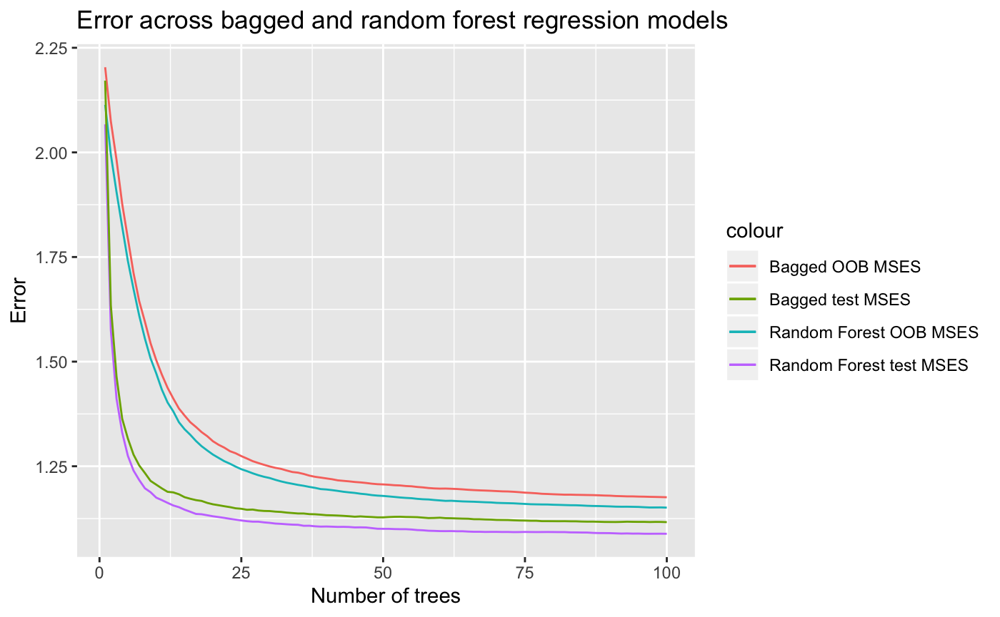

Yelp!
================
Claire Jellison and Jacob Goldsmith and Ryan Kobler
12/11/2019

### Abstract

The Yelp dataset includes over 5 million text reviews from businesses around the world. We aim to predict the number of stars a reviewer gives a business from the text of the review itself. To do so, we take two approaches: connecting review words to sentiment dictionaries and learning from the data itself. Because the nature of our response variable is ordered, we also think about how the fit of our model should be judged using a handful of different error measurements.

To glean meaning from the words a reviewer uses, we turned first to the NRC sentiment dictionary. This is a basket of over 14,000 words manually coded into 9 sentiments based on surveys from human reviewers. In this way, each word on its own (devoid of surrounding context) has a meaning determined a priori by the categories the sample of reviewers chose. We also assign rankings based upon the Afinn dictionary for every pair of words, or bigram, within a review. Afinn uses a numeric scale so that we can easily flip the score of any negated word pair such as "not good." Our misclassification rates (MCR) ranged between 0.473 and 0.535, attributed in part to high correct classification rates for 1 and 5 star reviews but abysmal correct classifications for 2 and 3 star reviews. Tree-based methods tended to perform best, but all methods performed worse in the 2-3 star case.

### Introduction

Our task is inherently prediction-based. Can statistical learning models learn to process language used in Yelp reviews? This remains an important question within the larger field of Natural Language Processing that this project merely scratches the surface of. Natural Language Processing comprises an integral branch of computer science intended to manipulate and interpret human language, an increasingly important task given the growing collection of text data generated every day. Thus we search for structure within data that is inherently unstructured and incredibly diverse. Our predictors from the text were mainly single word and bigram phrases, and the analysis below became an exercise this kind of processing.

### The Data

Where does the data come from? How many observations? How many variables? What does each observation refer to (what is the observational unit)? What sorts of data processing was necessary to get the data in shape for analysis?

We turn to the extensive [Yelp Kaggle data set](https://www.kaggle.com/yelp-dataset/yelp-dataset/version/6#yelp_review.csv), which contains 5,200,000 reviews and the 7 variables below:

-   `text`: contains the text of the review as a string

-   `business_id`: identifier for the business being reviewed, character

-   `review_id`: unique identifier for each review (observations are uniquely identified by this), character

-   `user_id`: identifier for each user submitting a review, character

-   `cool`: number of people who found the review "cool", numeric

-   `funny`: number of people who found the review "funny", numeric

-   `useful`: number of people who found the review "useful", numeric

Though there are interesting extenstions in the the other variables given in the raw data set, all predictors for this analysis come from transformations to the raw `text` variable.

The Yelp data set's size gives plenty of test data to work with, so we create four different data sets to fit (training) then assess (test) our model. So generally, we need not use cross validation to estimate our models' test errors.

| Feature Extraction Approach |       Training       |         Test        |
|:---------------------------:|:--------------------:|:-------------------:|
|    Sentiment dictionaries   |   52,945 x 37 table  |   9,850 x 37 table  |
|         Bag of words        | 20,000 x 2,004 table | 9,850 x 2,004 table |

### Exploratory Data Analysis

The bulk of our data exploration comes at our choices of features to extract, then the methodology by which to extract those features.

#### Sentiment dictionaries

Cleaning process:

1.  Drop all stop words from the review such as "the", "in", "to", "a", etc.

-   Count \# non-stop words

1.  Remove all non-English reviews using the `textcat` package.

2.  Tokenize the words (used `stringr` library to split by space, and grepl function to remove unnessessary punctuation, etc). so that we are left with only meaningful words.

3.  Join words from the sentiment categories in NRC and count number of words in each review by sentiment that are categorized into a sentiment.

This resulted a dataset with the dimensions listed above.

``` r
x <- train_senti %>% select(-c(X.1, X, X1))
glimpse(x)
```

    ## Observations: 51,945
    ## Variables: 34
    ## $ review_id         <fct> l0c-gTpyEHIBeH6qG7iekw, 864AWE6eqipNE7SPVYSGRg…
    ## $ user_id           <fct> hyMa8iiLndcfqF3qJdN67w, cMEtAiW60I5wE_vLfTxoJQ…
    ## $ business_id       <fct> grZEbAsZwWA3yJMwDRl0Nw, LR1JNvpNrx2N4HNAyhHvrg…
    ## $ stars             <int> 4, 5, 2, 1, 2, 4, 3, 2, 5, 5, 4, 5, 3, 5, 5, 4…
    ## $ date              <fct> 2011-02-20, 2014-08-11, 2016-12-14, 2017-03-31…
    ## $ text              <fct> "I only came here for lunch so I can only spea…
    ## $ useful            <int> 3, 3, 0, 0, 0, 4, 2, 0, 0, 2, 2, 1, 0, 22, 0, …
    ## $ funny             <int> 0, 2, 0, 0, 2, 5, 0, 0, 0, 0, 1, 0, 0, 14, 0, …
    ## $ cool              <int> 2, 2, 0, 0, 0, 6, 0, 0, 0, 0, 1, 1, 0, 23, 0, …
    ## $ joy               <int> 4, 6, 2, 3, 5, 6, 6, 8, 4, 11, 4, 9, 5, 3, 2, …
    ## $ starsfactor       <int> 4, 5, 2, 1, 2, 4, 3, 2, 5, 5, 4, 5, 3, 5, 5, 4…
    ## $ anger             <int> 0, 1, 2, 1, 5, 1, 5, 2, 0, 2, 0, 1, 1, 0, 0, 1…
    ## $ nwords            <int> 75, 94, 50, 412, 231, 80, 192, 248, 18, 340, 6…
    ## $ joyratio          <dbl> 0.053333333, 0.063829787, 0.040000000, 0.00728…
    ## $ disgust           <int> 0, 1, 2, 1, 3, 2, 4, 1, 0, 3, 0, 0, 3, 0, 0, 1…
    ## $ negative          <int> 0, 2, 3, 14, 6, 1, 5, 4, 1, 5, 2, 2, 4, 0, 2, …
    ## $ positive          <int> 5, 12, 2, 18, 10, 8, 8, 12, 5, 20, 7, 10, 9, 5…
    ## $ angerratio        <dbl> 0.000000000, 0.010638298, 0.040000000, 0.00242…
    ## $ language          <fct> english, english, english, english, english, e…
    ## $ fear              <int> 0, 1, 1, 2, 3, 1, 1, 2, 1, 3, 1, 2, 4, 0, 2, 1…
    ## $ surprise          <int> 2, 2, 0, 1, 2, 4, 4, 6, 1, 7, 1, 2, 3, 0, 2, 0…
    ## $ trust             <int> 4, 4, 2, 13, 5, 6, 6, 8, 5, 15, 3, 6, 4, 4, 5,…
    ## $ anticipation      <int> 1, 5, 1, 17, 5, 5, 7, 5, 1, 14, 3, 3, 5, 3, 9,…
    ## $ fearratio         <dbl> 0.000000000, 0.010638298, 0.020000000, 0.00485…
    ## $ positiveratio     <dbl> 0.06666667, 0.12765957, 0.04000000, 0.04368932…
    ## $ negativeratio     <dbl> 0.000000000, 0.021276596, 0.060000000, 0.03398…
    ## $ surpriseratio     <dbl> 0.026666667, 0.021276596, 0.000000000, 0.00242…
    ## $ disgustratio      <dbl> 0.000000000, 0.010638298, 0.040000000, 0.00242…
    ## $ trustratio        <dbl> 0.053333333, 0.042553191, 0.040000000, 0.03155…
    ## $ anticipationratio <dbl> 0.013333333, 0.053191489, 0.020000000, 0.04126…
    ## $ score             <dbl> 0.8333333, 1.1000000, 0.7500000, -0.0500000, -…
    ## $ sentences         <int> 5, 7, 5, 30, 21, 7, 19, 17, 3, 15, 4, 7, 7, 4,…
    ## $ punct             <int> 11, 15, 8, 70, 42, 25, 30, 35, 3, 28, 13, 9, 4…
    ## $ exclaim           <int> 0, 2, 0, 0, 0, 0, 5, 1, 3, 6, 2, 3, 0, 3, 0, 1…

-   `nwords`: number of words in a given review

-   `punct`: number of punctuation marks except apostrophes

-   `score`: average sentiment for all adjacent two-word pairs or bigrams within a given review negations were negated by their second word. (i.e. if "good" = 2 then "not good" = -2)

-   `sentences`: number of sentences within a given review

-   `exclaim`: number of exclamation marks within a given review

-   `joy`: number words categorized as "joy" within the NRC lexicon

-   `disgust`: number words categorized as "disgust" within the NRC lexicon

-   `anger`: number words categorized as "anger" within the NRC lexicon

-   `fear`: number words categorized as "fear" within the NRC lexicon

-   `positive`: number words categorized as "postive" within the NRC lexicon

-   `trust`: number words categorized as "trust" within the NRC lexicon

-   `negative`: number words categorized as "negative" within the NRC lexicon

-   `anticipation`: number words categorized as "anticipation" within the NRC lexicon


Figure shows that our sample is left skewed. The bulk of the reviews are clustered at 5, 4, then 1. Two and three-star reviews jointly comprise only 19.7% of all reviews. Therefore, we might expect classification models to do worse overall at predicting these categories. 2-3 star "middle-of-road" reviews may lack strong sentiment words at either end of the spectrum, so we hypothesize that our sentiment libraries may have trouble predicting lukewarm reviews.


The graphs above may appear counterintuitive. But more 5-star reviews overall meant more chances in which the negativeratio could rocket up. The table of summary statistics reveals that postive leaning sentiments (joy, positive, etc.) were not necessarily increasing in stars. So we think the `score` variable may dampen the effect of negated positive or joyful words in lower scoring reviews.


##### Normalization caveat:

Given that the number of words recognized in the NRC dictionary that fall into each individual category are not normalized, our counts of each sentiment could be biased. But dividing by the number of words in each category can serve to normalize the fraction of the review devoted to a particular sentiment. However, we found that whether using the raw counts of the sentiments or the ratios, our training and test errors across the models were similar.


In Figure we can see that positively identified words are correlated with higher levels of stars, whereas the cluster of dark blue indicates that the presence of more disgust words in proportion to the total number of words is correlated with lower stars.

In the figure below, the number of stars appears to be decreasing in the number of words in general. This could be because people at the lower end of the star spectrum might have more to say, or describe specific instances or stories in which their expectations were not met.


#### No natural clustering into 5 categories using K-means

 

Above, we can see the scree plot and biplot for the principle componenet analysis. We see that there are two general directions that most of the sentiments fall into. The ones we would generally consider positive and another group of the ones that we would generally consider negative. We also see that there is a clear elbow in the scree plot and that two principle components seems like the ideal number since afterward the reductions in percent of variance explained are relatively minor. We did not find this that surprising and think that it may be in part due to a lack of neutral words such as "okay" or "fine" that do not fall into the sentiment dictionaries. Additionally, we think that most of the emotions are generally associated with either upward or downward movement on the scale of stars. That is, we wouldn't expect say disgust to be associated with giving two stars, but rather it would just lead to a lower number of starts. In other words, we are lacking predictors that focus on neutral reviews leading to poor preldictions for mid range stars.


We tried k-means with 5 clusters in order to see if there was any inherit grouping in our data. We tried with 5 clusters hoping that the model might detect that natural groupings of stars. As seen in the visualization above, this did not prove very effective. We see that our principle componenets worked to some extent at detecting the ways in which very high star reviews such as 4s and 5s (lower left hand corner) and very low star reviews like 1s (upper right hand corner) were different from other reviews. Again, to some extent we think that the lack of spread in the plot above is somewhat attributable to not having good predictors that are specific to neutral reviews of 2s or 3s. It also seems probable that it is much harder to distinguish clear cluster is ordinal categorical variables than in normal categorical variables.

#### Bag of Words Approach

However, due to the external structure and meaning both the Afinn and NRC dictionaries impose on the words within the reviews, we aims to learn from the raw words in the data itself. Rather than deciding a priori which words carry meaning, and are correlated with our response, we choose the most frequent words (that are not stop words) that appear in the entire sample. We counted the number of times each of the most frequent words appear in a single review and added them as predictors to a new data frame. In this way, after fitting tree-based models and examining their variable importance plots, we can begin to get a flavor of the kinds of words that are highly correlated with the number of stars a reviewer gives. Among them were "rude," "customer," "never," "minutes" or words that intuitively may lack an intrinsic sentiment brand, but clearly in the context of Yelp reviews could potentially sway a review one way or another. For example, a reviewer that draws attention to the fact that they are a "customer" may view the experience more transactionally, and possibly more negatively. Therefore, we hypothesize that this approach, and wielding far more predictors could enhance the predictive power of our model.

### Modeling

To answer one of our initial questions, proper treatment of ordered classes, we fit a series of classification and regression models. We had three main types of models:

Regression based models:
------------------------

Linear Model
------------

The most simple model we tried fitting was a basic linear model to serve as a baseline to compare our other models to. However, because our reponse variable of interest is both discrete and ordinal, we also had to design a function in order to predict discrete values. This allowed us to get a missclassification error that we can compare with the other models. Therefore, we wrote a function that predicts 5 for all predicted values greater than 5 and that predicts 1 for all predicted values less than 1. Additionally, it rounds all other value to the nearest integer. This missclassification error was 0.645597.

Ordinal Logistic Regression
---------------------------

Clearly, a significant disadvantage to the linear model, is that it is treating the reponse variable as continuous rather than categorical. The advantage is it does preserve the ordinal nature of the reponse variable. A regression model that both treats the reponse variable as categorical and ordinal is the ordinal logistic regression model.

The following equation is from the wikipedia page,
Pr(*y* ≤ *i*|**x**)=*σ*(*θ*<sub>*i*</sub> − **w** ⋅ **x**)
 Here *θ*<sub>*i*</sub> are the threshold values and $\\mathbf w$ is the coefficient vector. For our *σ* we chose the logistic function.

For this model, we used the polr command from the MASS library. The initial missclassification rate without any transformation was around 0.83 on the test data set. However, a quick look at the confusion matrix revealed the reason for this extraordinarily high missclassification rate. The issue was that the oridinal logistic model was only predicting 1, 4, and 5 stars instead of the full range of stars. In order to modify it so that it would be biased it favor of predicting 2's and 3's we wrote a modified predict function. Instead of predicting the number of stars from the ordinal logistic model, we instead used the predict function that gives that probability of it belonging to any of the 5 categories. Normally, it would choose the category with the greatest probability, but in the modified predict function we wrote, if 1 star has the greatest probability but it is not that great (given some cutoff value) we have it predict 2 and similarly if 4 has the greatest probability but not it is not above some cutoff value we have it predict 3. This function was obtained by trying to artificially construct the lowest training MSE, but when we applied the identical biased predict function to the test data set it still significantly increased preformance. The new test MSE because 0.499 which although not within competative range with the tree models is a large improvement.

Tree based models:
------------------

Random Forest v. Bagged
-----------------------

The bagged model is a special case of the random forest where no variables are removed at each partition. The bagged model would be expected to underperform the random forest if there is structure in the data that is obscured by the 'greedy' splits that are made to trees early on. Indeed, we will see from the next section that the random forest model, which uses a randomly selected third of the data to make each split, slightly outperforms the bagged model.

Random forests can overcome the problem of variance that arises from bagged trees by forcing each decision tree split to consider only a subset of the total predictors. Small *m* is helpful given a large number of correlated predictors, such as our bag of words data set (ISLR). This is true for our data as well--smaller *m*, given by the blue and purple lines, outperforms larger *m*. We expect the difference between *m* = *p* and $m = \\sqrt{p}$ to be more prevalent using the bag of words data. The table below shows our misclassification error for the best tree of each, indicating that the random forest did not improve our misclassification rate as much as expected for the bag of words model, doing even worse with the test MCR.

Bag of Words model - Misclassification Rate

| m                     |  OOB error |  Test  | NTrees |
|:----------------------|:----------:|:------:|:------:|
| Bagged model (m = p)  |    0.46    | 0.6028 |   92   |
| Random forest m = p/3 | **0.4476** |  0.611 |   100  |

with an out of bag error rate of 0.45, the random forest bag of words model represented an improvement over the sentiment library.

The confusion matrix below is our best, but not by much. The matrix reveals the prevailing shortcoming across all of our tree based model: inability to predict 2 and 3 star reviews. It is possible that the misclassification error may not be as useful a metric as the MSE to evaluate our models, stemming from a lack of variation between 2 and 3 star reviews, or that we need to extract better predictors.

``` r
# define and get rf.bag.class
rf.bag.class$confusion 
```

    ##     1  2  3   4    5 class.error
    ## 1 492 35 30  42   93   0.2890173
    ## 2 134 30 57  99   97   0.9280576
    ## 3  58 31 92 220  185   0.8430034
    ## 4  47 17 68 444  590   0.6192110
    ## 5  88  7 34 318 1692   0.2089762

``` r
impPlot <- data.frame(rf.bag.class$importance)
impPlot$predictor <- rownames(rf.bag.class$importance)
impPlot <- impPlot %>%
  arrange(desc(MeanDecreaseGini)) 
impPlot[1:20,]
```

    ##    MeanDecreaseGini predictor
    ## 1         475.39237     score
    ## 2          77.93273      good
    ## 3          38.45817     great
    ## 4          36.34868    pretty
    ## 5          32.80582      like
    ## 6          32.43454      told
    ## 7          31.17265      food
    ## 8          25.00355     place
    ## 9          24.07561 recommend
    ## 10         23.47186  horrible
    ## 11         22.47286        ok
    ## 12         22.32327       bit
    ## 13         21.58908   service
    ## 14         20.97871   amazing
    ## 15         19.77878    though
    ## 16         19.69019    little
    ## 17         19.48183      just
    ## 18         19.41209    really
    ## 19         18.59828    better
    ## 20         18.48761      best

Sentiment model - Misclassification Rate

| m                       | OOB error | Test  | NTrees |
|-------------------------|:----------|:------|:-------|
| Bagged model (m = p)    | 0.497     | 0.483 | 71     |
| Random forest (m = p/3) | 0.490     | 0.476 | 85     |

``` r
# Code below ensures that we don't have any missingness or non-numeric predictors
# in the dfs used to fit the model
cols <- colnames(train_senti)
drop <- grepl("ratio|X|id|funny|cool|useful", cols)
cols.counts <- setdiff(cols, cols[drop])
sentiments <- c("anger", "fear", "surprise", "trust", "disgust", "negative", "positive", "joy")
df <- train_senti %>% 
  select(score, stars, cols.counts) %>%
  select(-c(text, date, starsfactor, language))
df.test <- test_senti %>% 
  select(score, stars, cols.counts) %>%
  select(-c(text, date, starsfactor, language))
row.has.na <- apply(df, 1, function(x){any(is.na(x))})
df <- df[!row.has.na, ]
row.has.na <- apply(df.test, 1, function(x){any(is.na(x))})
df.test <- df.test[!row.has.na, ]
y.test <- df.test %>%
  pull(stars)
x.test <- df.test %>%
  select(-c(stars))
```

#### Sentiment Dictionary (MSE):



As we can see from the figure above, the random forest model appears to perform best overall, as its test and OOB MSEs were lowest consistently. Although the model performs better at slightly under 50 trees, it performs best on test data with 100 trees, so we went with the 100-tree model.


From the figure above, it is clear that when the bag of words data rf and bagged models underperformed with the test set. However, is extracting estimating with the top 500 training words on an entirely new test data set tractable? Because the predictors were learned from the data itself by taking the top 500 words, they may be less useful when applied to a wholly different data set. We might also think that using 500 predictors risked overfitting the model(??). The tables below shows the variable importances of each of the words in the bag of words data set for the best fitting random forest model. Note: we only used the first 5,000 of the 20,000 observations in the bag of words model to fit the tree models. So by the MSE metric, the winner is the random forest model on the sentiment dictionary.

LDA and QDA
-----------

LDA and QDA use Bayes' Theorem to classify observations. They assume that the probability density of *X* ∣ *Y* = *y* in the classes is multivariate normal. LDA carries the additional assumption that the variance of the pdf is the same in each class. To check the main assumption, we can compute variances and covariances among the classes for the most important variable, score:

``` r
var <- c(1:5)
for (i in 1:5) {
  var[i] <- var(train_senti[which(train_senti$stars == i),]$score, na.rm = T)
}
var
```

    ## [1] 1.3694882 1.2277291 1.0669584 0.7764920 0.8039531

We can see that the variance in score varies somewhat, but not massively. The changing variance could be a problem for the predictive accuracy of the model.

Boosting
--------

A gradient boosting machine is a very general method for prediction. As long as the number of trees is large and the shrinkage parameter *λ* is small, it should have low variance. Below are the variable importance plots for the gbm for classification and regression.


### Discussion

We took two main approaches in our modeling. First, we relied on pre-created dictionaries for feature extraction. This has the advantage of given structure to our analysis. Our models did not have to learn how to group words together - the sentiment dictionaries did it for them. If these groupings are natural, it would reduce the dimensionality of the data without loss of information. The principle component analysis that we ran lent some credence to the idea that much of the variability in the data was captured by the "sentiment" that words were conveying. However, if these groupings do not capture all of the variation in the relationship between the words and the star ratings, the model could underperform.

Thus, our second modeling approach was to let the data teach us how to group the words. Each of the most commonly used 1000 words was coded as an integer variable indicating how many times the word was used in the text. The algorithm had no a priori information about the meaning of the words, nor about their likely groupings. This sort of modeling made the most sense to do with algorithms that do well with high dimensional predictor sets, such as ensembles of trees. Whereas individual trees and parametric models would be liable to have high variance with a high number of predictors, random forests get around this by taking bootstrap samples and randomly removing variables at each partition. This makes the resulting predictions more robust, because features in the data that by chance cause large swings in the model are averaged away during the course of bootstrap aggregation and variable deletion, leaving a model that is less sensitive to the "Rashomon effect".

We also have a conceptual split between regression and classification, with ordered regression falling in the middle. A classification model treats all of the values of the response variables as categories without any ordinal or cardinal value. A regression model treats the response as having both ordinal and cardinal value, usually using the Euclidean (*L*<sub>2</sub>) norm. Typically, an ordinal model posits the existence of a latent, continuous, cardinal response combined with partitions that divide the latent response into sections, each with an observed response category associated with it.

Our response has a clear ordinal structure, but it is less clear that it has an obvious cardinal interpretation. Under an *L*<sub>2</sub> norm, the distance between a 5 and a 3 is the same as the distance between a 3 and a 1. If this is true, a regression model may make sense, although it would still have to be censored at 1 and 5. If this is not the case, a regression model would probably be inappropriate. A classification model would have the advantage of not assuming any structure to the data that is not there, but the consequence is that it misses the ordinal structure that is there. This makes it seem like an ordinal regression model is ideal. However, many of the best machine learning algorithms do not have commonly available ordinal variants. Although a brief search of the literature revealed innovative ways to give ordinal structure to classification tree ensembles, most of those models had no straightforward implementation in R, and were thus beyond the scope of the project. As a result, the only explicitly ordinal model that we fit was an ordinal logistic regression.

Model Evaluation
----------------

The main metric we used to evaluate the models is misclassification rate. Another way of evaluating classification models is to compute the area under the ROC curve, which measures how the true positive rate increases if the threshold for classifying an observation as positive is lowered. A high AUC corresponds to a generally low misclassification rate at different thresholds. For our purposes, we are trying to get the highest overall prediction rate. We do not really care if a model predicts a 5 that is actually a 4 or a 4 that is actually a 5. Thus, the misclassification rate is a reasonable metric for us to use.

We can also use the MSE to evaluate our regression models. This is the square of the Euclidean distance between our predictions and the actual observation. The advantage of this is that it penalizes the model for making a prediction that is further apart from the actual observation, e.g. predicting a 5 on a true 1 is worse than predicting a 1 on a true 2. However, only the regression models can be compared along this metric, because the classifiers have no norm.

1.  Test Misclassification rate

Among the regression models using the sentiment dictionary, the random forest does the best, slightly beating out the gradient boosting machine. In the bag of words, the boosted model generally performs the best. When the regression models are evaluated on their ability to classify (meaning the responses are rounded), they generally perform poorly. Unlike the misclassification rates, the MSE's are hard to interpret. For one, the units are in *s**t**a**r**s*<sup>2</sup>. Even if the square root is taken so that the units are in stars, the square root of the mean squared error is not the same as the mean error because of the nonlinearity of exponentials. Generally, though, the average squared error is about 1 for most of the better models, meaning they likely tend to mispredict the true rating by about 1 star.

The model with the overall best test misclassification rate is the random forest performed on the sentiment dictionary, with a misclassification rate of 0.4699. This was only slightly better than the performance of the boosted trees and the boostrap aggregated trees. Technical issues prevented us from predicting into the test dataset for the random forest models performed on the bag of words. However, the boosted trees produced a mediocre 0.5352 misclassification rate. The random forest models would have likely been similar.

The natural assumption would be that the bag of words overfits, but this may not be the case. The out-of-bag error for the random forest model is actually 0.469, the lowest of any model (barely). This suggests that the problem is more that the bag of words is finding words in the training data and using the top 1000 most common words to predict into the test data. Presumably, the most common words in the training data are different from the most common words in the test data. The out of bag observations, although they are not used to fit the tree, are still used to find the most common words. This suggests that if the model were allowed to compute the most common words in the test data and use those in the forest, it would get a misclassification rate of around what the out-of-bag error is computing, slightly better accuracy than the sentiment dictionary. This would be interesting to test empirically in the future.

### Conclusions

Our experience with this dataset shows the difficulty of predictive modeling. The uneven distribution of the response made prediction into the intermediate values challenging. The fact that we started with text, not a numerical matrix or vector, made feature extraction a non-obvious exercise. Is it better to let the data tell you what variables to construct, or is it better to specify a feature set a priori? It turns out that the answer depends on your metric for success. We found that our sentiment dictionary predicted better into test data, but our results point to that being a function of the different most common words used in the training fraction as in the test. Is it better to treat an ordinal response variable as cardinal or as categorical (if you can't implement a good ordinal model)? For this data, it seems better to treat it as categorical -- however, you lose the ability to test based on distance. To do good data science, these are the sorts of questions that need to be carefully considered and addressed.

### Extensions

There are a considerable number of extensions that could be made to this project. For one, we could seek to find a dataset that includes multiple reviews from the same users. This would allow us to calculate user-specific z-scores. Throughout this project a significant difficulty has been identifying mid range star reviews. We think this may in large part be due to the fact that users may consider different numbers of stars to correspond to a an "average" restuarant. This means that they may use the similar language in a review but give a different star value solely because they have a different idea of what 3 stars means to them. Essentially, adding users to our model would allow our model to account for differences within different reviewers which is currently an important absent variable in our models. We expect that with this addition, there would be significant improvements in our missclassification error, especially for mid-range stars.

Another possible extension would be attempting to identify longer length phrases. Currently, using negation words we have accounted for phrases like "not good". However, it would be worthwhile to extend this to even larger phrases. Consider the phrases "not very good" or "isn't all that bad". These type of often used phrases are not being very well leveraged by our current models, but could potentially have very strong explanatory power. One way to identify these type of phrases may be to search for words that often appear together in the strings of text and the create predictors out of those phrases. This is an incredibly challengin problem since the meaning of each individual word depends so much on the context in which it is used.

### References

James, Gareth, Daniela Witten, Trevor Hastie, and Robert Tibshirani, eds. 2013. An Introduction to Statistical Learning: With Applications in R. New York: Springer.

Crowdsourcing a Word-Emotion Association Lexicon, Saif Mohammad and Peter Turney, Computational Intelligence, 29 (3), 436-465, 2013.

Emotions Evoked by Common Words and Phrases: Using Mechanical Turk to Create an Emotion Lexicon, Saif Mohammad and Peter Turney, In Proceedings of the NAACL-HLT 2010 Workshop on Computational Approaches to Analysis and Generation of Emotion in Text, June 2010, LA, California.

<https://en.wikipedia.org/wiki/Ordinal_regression>
