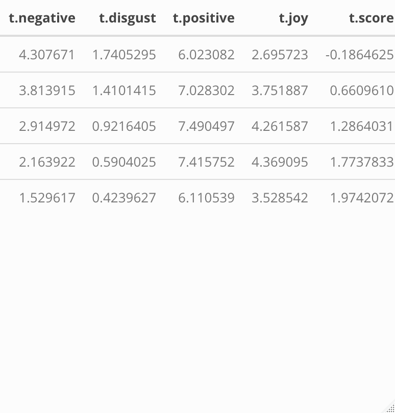

```{r include=FALSE}
# styles
library(gridExtra)
library(kableExtra)

library(dplyr)
library(ggplot2)
library(randomForest)
```

Your technical report should be an .Rmd file that contains the following sections. So as not to make the compilation (knitting) of the document not take too long, consider setting cache = TRUE in the curly braces of any R chunk with substantial computing. Please knit both to pdf and github document (.md).

### Abstract
A brief overview of the area that you’ll be investigating, the research question(s) of interest, your approach to analysis, and the general conclusions.

The Yelp dataset includes over 5 million text reviews from businesses around the world. We aim to predict the number of stars a reviewer gives a business from the text of the review itself. To do so, we take two approaches: connecting review words to sentiment dictionaries and learning from the data itself. Because the nature of our response variable is ordered, we also think about how the fit of our model should be judged using a handful of different error measurements.

To glean meaning from the words a reviewer uses, we turned first to the NRC sentiment dictionary. This is a basket of over 14,000 words manually coded into 9 sentiments based on surveys from human reviewers. In this way, each word on its own (devoid of surrounding context) has a meaning determined a priori by the categories the sample of reviewers chose. We also assign rankings based upon the Afinn dictionary for every pair of words, or bigram, within a review. Afinn uses a numeric scale so that we can easily flip the score of any negated word pair such as "not good."  Our misclassification rates (MCR) ranged between 0.473 and 0.535, attributed in part to high correct classification rates for 1 and 5 star reviews but abysmal correct classifications for 2 and 3 star reviews. Tree-based methods tended to perform best, but all methods performed worse in the 2-3 star case.        


### Introduction
Overview of the setting of the data, existing theories/models (particularly if you are working in a descriptive/inferential setting), and your research questions.

Our task is prediction-based. After reading a review, it's easy for humans to place it into the proper rating. We examine each individual word's meaning, look for dependencies between words, discern the strength of a sentiment based upon context clues, correct misspellings automatically, note sarcasm, among others. Can statistical learning models learn to process language used in Yelp reviews? Our predictors from the text were mainly single word and bigram phrases, and the analysis below became an exercise in natural language processing.

### The Data
Where does the data come from? How many observations? How many variables? What does each observation refer to (what is the observational unit)? What sorts of data processing was necessary to get the data in shape for analysis?

We turn to the extensive [Yelp Kaggle data set](https://www.kaggle.com/yelp-dataset/yelp-dataset/version/6#yelp_review.csv), which contains 5,200,000 reviews and the 7 variables below: 

- `text`: contains the text of the review as a string

- `business_id`: identifier for the business being reviewed, character

- `review_id`: unique identifier for each review (observations are uniquely identified by this), character

- `user_id`: identifier for each user submitting a review, character

- `cool`: number of people who found the review "cool", numeric

- `funny`: number of people who found the review "funny", numeric

- `useful`: number of people who found the review "useful", numeric

Though there are interesting extenstions in the the other variables given in the raw data set, all predictors for this analysis come from transformations to the raw `text` variable.

The Yelp data set's size gives plenty of test data to work with, so we create four different data sets to fit (training) then assess (test) our model. So generally, we need not use cross validation to estimate our models' test errors. 

| Feature Extraction Approach | Training | Test |
|:---------:|:---------:|:-------:|
| Sentiment dictionaries | 52,945 x 37 table | 9,850 x 37 table |
| Bag of words | 20,000 x 2,004 table | 9,850 x 2,004 table | 

```{r, cache = TRUE, echo=FALSE}
ctrain_bag <- read.csv("DATA/train_bag.csv")
train_senti <- read.csv("DATA/train_senti.csv")
train_bag <- read.csv("DATA/train_bag.csv")
test_senti <- read.csv("DATA/test_senti.csv")
test_bag <- read.csv("DATA/test_bag.csv")

library(dplyr)
library(ggplot2)
library(kableExtra)
library(randomForest)
```


### Exploratory Data Analysis
**Explore the structure of the data through graphics. Here you can utilize both traditional plots as well as methods from unsupervised learning. Understanding the distribution of your response is particular important, but also investigate bivariate and higher-order relationships that you expect to be particular interesting.

The bulk of our data exploration comes at our choices of features to extract and the methodology by which to extract those features. 

#### Sentiment dictionaries

Cleaning process:

1) Drop all stop words from the review such as "the", "in", "to", "a", etc.

  - Count # non-stop words
  
2) Remove all non-English reviews using the `textcat` package.

3) Tokenize the words (used `stringr` library to split by space, and `grepl()` function to remove unnessessary punctuation, etc). so that we are left with only meaningful words,

4) Join words from the sentiment categories in NRC and count number of words in each review by sentiment that are categorized into a sentiment.

See link to accompanying RMarkdown of all code used to clean and produce the features.


This resulted a dataset with the dimensions listed above. 
```{R}
x <- train_senti %>% select(-c(X.1, X, X1))
glimpse(x)
```
- `nwords`: number of words in a given review

- `punct`: number of punctuation marks except apostrophes

- `score`: average sentiment for all adjacent two-word pairs or bigrams within a given review negations were negated by their second word. (i.e. if "good" = 2 then "not good" = -2)

- `sentences`: number of sentences within a given review

- `exclaim`: number of exclamation marks within a given review

- `joy`: number words categorized as "joy" within the NRC lexicon

- `disgust`: 

- `anger`: 

- `fear`: 

- `positive`: 

- `trust`: 

- `negative`: 

- `anticipation`: 


```{r fig1, echo=FALSE, fig.cap="\\label{fig:fig1}Distribution of the Response", cache=TRUE}
ggplot(train_senti, aes(starsfactor)) + 
  geom_histogram(binwidth=1) + 
  ggtitle("Bar Graph of Stars")
nrow(train_senti %>% filter(stars == 2 | stars == 3)) / nrow(train_senti)
```

Figure \ref{fig:fig1} shows that our sample is left skewed. The bulk of the reviews are clustered at 5, 4, then 1. Two and three-star reviews jointly comprise only 19.7% of all reviews. Therefore, we might expect classification models to do worse overall at predicting these categories. 2-3 star "middle-of-road" reviews may lack strong sentiment words at either end of the spectrum, so we hypothesize that our sentiment libraries may have trouble predicting lukewarm reviews.   

```{r, cache=TRUE}
# Disgust
disgust <- ggplot(train_senti, aes(starsfactor, disgustratio)) + 
  geom_bar(stat = "identity") +
  ggtitle("Distribution of disgust words")

# Negativity
negativ <- ggplot(train_senti, aes(stars, negativeratio)) + 
  geom_bar(stat = "identity") +
  ggtitle("Distribution of negative words")

grid.arrange(disgust, negativ)
```

The graphs above may appear counterintuitive. But more 5-star reviews overall meant more chances in which the negativeratio could rocket up. The table of summary statistics reveals that postive leaning sentiments (joy, positive, etc.) were not necessarily increasing in stars. So we think the `score` variable may dampen the effect of negated positive or joyful words in lower scoring reviews. 



```{r}
t.score <- train_senti %>%
  group_by(stars) %>%
  summarise(means = mean(score, na.rm = T)) %>%
  pull(means)

t.joyratio <- train_senti %>%
  group_by(stars) %>%
  summarise(means = mean(joyratio, na.rm = T)) %>%
  pull(means)

t.joy <- train_senti %>%
  group_by(stars) %>%
  summarise(means = mean(joy, na.rm = T)) %>%
  pull(means)

t.positive <- train_senti %>%
  group_by(stars) %>%
  summarise(means = mean(positive, na.rm = T)) %>%
  pull(means)

t.disgust <- train_senti %>%
  group_by(stars) %>%
  summarise(means = mean(disgust, na.rm = T)) %>%
  pull(means)

t.negative <- train_senti %>%
  group_by(desc(stars)) %>%
  summarise(means = mean(negative, na.rm = T)) %>%
  pull(means)

library(kableExtra)

table <- rbind(t.negative, t.disgust, t.positive, t.joy, t.score)
colnames(table) <- c(1:5)
table <- t(table)
rownames(table) <- c(1:5)
```

```{r fig2, echo = FALSE, fig.cap="\\label{fig:fig2}Scatter of Stars", cache=TRUE}
ggplot(train_senti, aes(x=positive, y = disgust)) + 
  geom_jitter(aes(color = stars)) + 
  ggtitle("Scatter of Stars") 
```

In Figure \ref{fig:fig2} we can see that positively identified words are correlated with higher levels of stars, whereas the cluster of dark blue indicates that the presence of more disgust words in proportion to the total number of words is correlated with lower stars. 

In the figure below, the number of stars appears to be decreasing in the number of words in general. This could be because people at the lower end of the star spectrum might have more to say, or describe specific instances or stories in which their expectations were not met(??lol wait does this make sense). 
```{r fig3, echo = FALSE, fig.cap="\\label{fig:fig3}Scatterplot of number of words in a review vs. stars"}
ggplot(data = train_senti, aes(x = nwords, y = stars)) + 
  geom_jitter(size = 0.25) + 
  geom_smooth() #stars
```

#### Natural clustering into 5 categories using K-means
```{}
#  k-means visualization
```

### Modeling
Construct (descriptive and/or predictive) (classification and/or regression) models that address your research questions. You are encouraged to fit many different classes of models and see how they compare in terms the bias/variance tradeoff (do you have a Rashomon effect going on?). Also be sure to guard against overfitting through cross-validation or shrinkage/penalization (don’t forget about ridge regression and the lasso).

This will be the most extensive section and will include your results as well.

To answer one of our initial questions, proper treatment of ordered classes, we fit a series of classification and regression models. We had three main types of models:


### Discussion
Review the results generated above and sythensize them in the context from which the data originated. What do the results tell your about your original research question? Are there any weaknesses that you see in your analysis? What additional questions would you explore next?

We took two main approaches in our modeling. First, we relied on pre-created dictionaries for feature extraction. This has the advantage of given structure to our analysis. Our models did not have to learn how to group words together - the sentiment dictionaries did it for them. If these groupings are natural, it would reduce the dimensionality of the data without loss of information. The principle component analysis that we ran lent some credence to the idea that much of the variability in the data was captured by the "sentiment" that words were conveying. However, if these groupings do not capture all of the variation in the relationship between the words and the star ratings, the model could underperform.

Thus, our second modeling approach was to let the data teach us how to group the words. Each of the most commonly used 1000 words was coded as an integer variable indicating how many times the word was used in the text. The algorithm had no a priori information about the meaning of the words, nor about their likely groupings. This sort of modeling made the most sense to do with algorithms that do well with high dimensional predictor sets, such as ensembles of trees. Whereas individual trees and parametric models would be liable to have high variance with a high number of predictors, random forests get around this by taking bootstrap samples and randomly removing variables at each partition. This makes the resulting predictions more robust, because features in the data that by chance cause large swings in the model are averaged away during the course of bootstrap aggregation and variable deletion, leaving a model that is less sensitive to the "Rashemon effect".

We also have a conceptual split between regression and classification, with ordered regression falling in the middle. A classification model treats all of the values of the response variables as categories without any ordinal or cardinal value. A regression model treats the response as having both ordinal and cardinal value, usually using the Euclidean ($L_2$) norm. Typically, an ordinal model posits the existence of a latent, continuous, cardinal response combined with partitions that divide the latent response into sections, each with an observed response category associated with it.

Our response has a clear ordinal structure, but it is less clear that it has an obvious cardinal interpretation. Under an $L_2$ norm, the distance between a 5 and a 3 is the same as the distance between a 3 and a 1. If this is true, a regression model may make sense, although it would still have to be censored at 1 and 5. If this is not the case, a regression model would probably be inappropriate. A classification model would have the advantage of not assuming any structure to the data that is not there, but the consequence is that it misses the ordinal structure that is there. This makes it seem like an ordinal regression model is ideal. However, many of the best machine learning algorithms do not have commonly available ordinal variants. Although a brief search of the literature revealed innovative ways to give ordinal structure to classification tree ensembles, most of those models had no straightforward implementation in R, and were thus beyond the scope of the project. As a result, the only explicitly ordinal model that we fit.

RANDOM FOREST:

RANDOM FOREST v. BAGGED MODELS:

Benefits - can overcome the problem of variance that arises from bagged trees by forcing each decision tree split to consider only a subset of the total predictors. Small $m$ is helpful given a large number of correlated predictors, such as our bag of words data set (ISLR). This is true for our data as well--smaller $m$, given by the blue and purple lines, outperforms larger $m$. We expect the difference between $m = p$ and $m = \sqrt{p}$ to be more prevalent using the bag of words data. 

```{r}
# Code below ensures that we don't have any missingness or non-numeric predictors
# in the dfs used to fit the model
cols <- colnames(train_senti)
drop <- grepl("ratio|X|id|funny|cool|useful", cols)
cols.counts <- setdiff(cols, cols[drop])

sentiments <- c("anger", "fear", "surprise", "trust", "disgust", "negative", "positive", "joy")

df <- train_senti %>% 
  select(score, stars, cols.counts) %>%
  select(-c(text, date, starsfactor, language))

df.test <- test_senti %>% 
  select(score, stars, cols.counts) %>%
  select(-c(text, date, starsfactor, language))

row.has.na <- apply(df, 1, function(x){any(is.na(x))})
df <- df[!row.has.na, ]

row.has.na <- apply(df.test, 1, function(x){any(is.na(x))})
df.test <- df.test[!row.has.na, ]

y.test <- df.test %>%
  pull(stars)
x.test <- df.test %>%
  select(-c(stars))
```

### Fitting Random Forest and Bagged Models

#### Sentiment Dictionary: 
```{r}
set.seed(120)
# select only some of the observations for run time concerns
n <- 1000
# Tree-based methods ~ Regression
rf <- randomForest(data = df[1:n,], 
                   type = "regression",
                   stars~., 
                   xtest = x.test,
                   ytest = y.test,
                   ntree = 100, 
                   mtry = ncol(df) / 3)

# specify x.test and y.test arguments to calculate a test error
bagged <- randomForest(data = df[1:n,], 
                       type = "regression",
                       stars~., 
                       xtest = x.test,
                       ytest = y.test,
                       ntree = 100, 
                       mtry = ncol(df))


mse.df <- data.frame(rfs = rf$mse, 
                     bagged = bagged$mse,
                     rfs_test = rf$test$mse,
                     bagged_test = bagged$test$mse)
                     

forest.mses <- ggplot(data = mse.df, aes(x = c(1:100))) +
  geom_line(aes(y = bagged, color = "Bagged OOB MSES")) +
  geom_line(aes(y = rfs, color = "Random Forest OOB MSES")) + 
  geom_line(aes(y = rfs_test, color = "Random Forest test MSES")) + 
  geom_line(aes(y = bagged_test, color = "Bagged test MSES")) + 
  labs(title = "Error across bagged and random forest regression models") +
  xlab("Number of trees") +
  ylab("Error")
  
forest.mses

```
As we can see the random forest model appears to perform best overall, as its test and OOB MSEs were lowest consistently. Although the model performs better at slightly under 50 trees, it performs best on test data with 100 trees, so we kept the 100-tree model. 

From the figure above, it is clear that when the bag of words data rf and bagged models underperformed with the test set. However, is extracting estimating with the top 500 training words on an entirely new test data set tractable? Because the predictors were learned from the data itself, the reason the predictors may be less useful when applied to the test set. We might also think that using 500 predictors risked overfitting the model(??). The table below shows the variable importances of each of the words in the bag of words data set.


```{r}
importance.bag <- as.data.frame(rf.bag$importance)
importance.bag$predictor <- rownames(rf.bag$importance)
importance.bag %<>%
  arrange(desc(IncNodePurity)) %>% 
  kable() %>%
  kable_styling()

```


##LDA and QDA
LDA and QDA use Bayes' Theorem to classify observations. They assume that the probability density of $X\mid{Y}=y$  in the classes is multivariate normal. LDA carries the additional assumption that the variance of the pdf is the same in each class. To check the main assumption, we can compute variances and covariances among the classes for the most important variable, score:
```{r}
var <- c(1:5)
for (i in 1:5) {
  var[i] <- var(num_only[which(num_only$stars == i),]$score)
}
var
```
We can see that the variance in score varies somewhat, but not massively. The changing variance could be a problem for the predictive accuracy of the model.


##Boosting
A gradient boosting machine is a very general method for prediction. As long as the number of trees is large and the shrinkage parameter $\lambda$ is small, it should have low variance. Below are the variable importance plots for the gbm for classification and regression.

###Boosted Model - Sentiment Dictionary: Classification
```{r}
#variable importance
import_gbm <- varImp(boost, numTrees = 1000)
import_gbm$varnames <- rownames(import_gbm)
ggplot(import_gbm, aes(x=reorder(varnames, Overall), weight = Overall)) + 
  geom_bar(color = "Blue") +
  scale_fill_discrete(name="Variable Group") +
  ylab("Importance") +
  xlab("Variable Name") +
  theme(text = element_text(size = 20), 
        axis.text.x = element_text(size = 10, angle=90, hjust=1))
```
###Boosted Model: Regression
```{r}
#variable importance
import_gbm <- varImp(boost2, numTrees = 500)
import_gbm$varnames <- rownames(import_gbm)
ggplot(import_gbm, aes(x=reorder(varnames, Overall), weight = Overall)) + 
  geom_bar(color = "Blue") +
  scale_fill_discrete(name="Variable Group") +
  ylab("Importance") +
  xlab("Variable Name") +
  theme(text = element_text(size = 20), 
        axis.text.x = element_text(size = 10, angle=90, hjust=1))
```

## Model Evaluation
The main metric we used to evaluate the models is misclassification rate. Another way of evaluating classification models is to compute the area under the ROC curve, which measures how the true positive rate increases if the threshold for classifying an observation as positive is lowered. A high AUC corresponds to a generally low misclassification rate at different thresholds. For our purposes, we are trying to get the highest overall prediction rate. We do not really care if a model predicts a 5 that is actually a 4 or a 4 that is actually a 5. Thus, the misclassification rate is a reasonable metric for us to use.

We can also use the MSE to evaluate our regression models. This is the square of the Euclidean distance between our predictions and the actual observation. The advantage of this is that it penalizes the model for making a prediction that is further apart from the actual observation, e.g. predicting a 5 on a true 1 is worse than predicting a 1 on a true 2. However, only the regression models can be compared along this metric, because the classifiers have no norm.

The model with the overall best test misclassification rate is the random forest performed on the sentiment dictionary, with a misclassification rate of 0.4699. This was only slightly better than the performance of the boosted trees and the boostrap aggregated trees. Technical issues prevented us from predicting into the test dataset for the random forest models performed on the bag of words. However, the boosted trees produced a mediocre 0.5352 misclassification rate. The random forest models would have likely been similar.

The natural assumption would be that the bag of words overfits, but this may not be the case. The out-of-bag error for the random forest model is actually 0.469, the lowest of any model (barely). This suggests that the problem is more that the bag of words is finding words in the training data and using the top 1000 most common words to predict into the test data. Presumably, the most common words in the training data are different from the most common words in the test data. The out of bag observations, although they are not used to fit the tree, are still used to find the most common words. This suggests that if the model were allowed to compute the most common words in the test data and use those in the forest, it would get a misclassification rate of around what the out-of-bag error is computing, slightly better accuracy than the sentiment dictionary. This would be interesting to test empirically in the future.

Among the regression models using the sentiment dictionary, the random forest does the best, slightly beating out the gradient boosting machine. In the bag of words, the boosted model generally performs the best. When the regression models are evaluated on their ability to classify (meaning the responses are rounded), they generally perform poorly. Unlike the misclassification rates, the MSE's are hard to interpret. For one, the units are in $stars^2$. Even if the square root is taken so that the units are in stars, the square root of the mean squared error is not the same as the mean error because of the nonlinearity of exponentials. Generally, though, the average squared error is about 1 for most of the better models, meaning they likely tend to mispredict the true rating by about 1 star.

### References
James, Gareth, Daniela Witten, Trevor Hastie, and Robert Tibshirani, eds. 2013. An Introduction to Statistical Learning: With Applications in R. New York: Springer.

Crowdsourcing a Word-Emotion Association Lexicon, Saif Mohammad and Peter Turney, Computational Intelligence, 29 (3), 436-465, 2013.

Emotions Evoked by Common Words and Phrases: Using Mechanical Turk to Create an Emotion Lexicon, Saif Mohammad and Peter Turney, In Proceedings of the NAACL-HLT 2010 Workshop on Computational Approaches to Analysis and Generation of Emotion in Text, June 2010, LA, California.