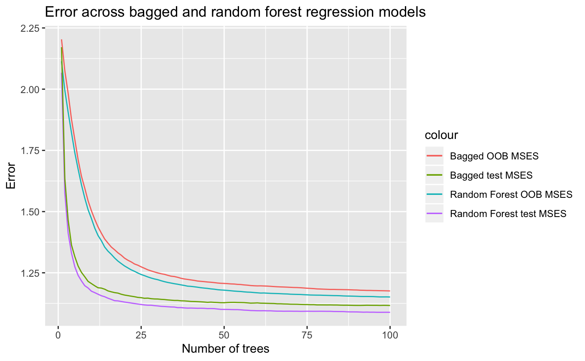
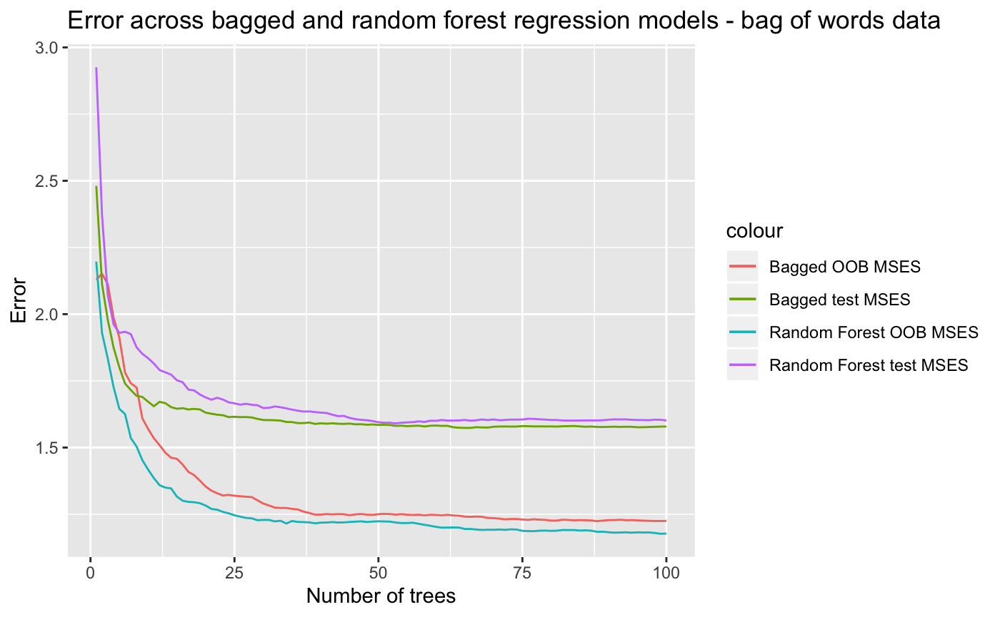

```{r include=FALSE}
# styles
library(gridExtra)
library(kableExtra)

library(dplyr)
library(ggplot2)
library(randomForest)
```

Your technical report should be an .Rmd file that contains the following sections. So as not to make the compilation (knitting) of the document not take too long, consider setting cache = TRUE in the curly braces of any R chunk with substantial computing. Please knit both to pdf and github document (.md).

### Abstract
A brief overview of the area that you’ll be investigating, the research question(s) of interest, your approach to analysis, and the general conclusions.

The Yelp dataset includes over 5 million text reviews from businesses around the world. We aim to predict the number of stars a reviewer gives a business from the text of the review itself. To do so, we take two approaches: connecting review words to sentiment dictionaries and learning from the data itself. Because the nature of our response variable is ordered, we also think about how the fit of our model should be judged using a handful of different error measurements.

To glean meaning from the words a reviewer uses, we turned first to the NRC sentiment dictionary. This is a basket of over 14,000 words manually coded into 9 sentiments based on surveys from human reviewers. In this way, each word on its own (devoid of surrounding context) has a meaning determined a priori by the categories the sample of reviewers chose. We also assign rankings based upon the Afinn dictionary for every pair of words, or bigram, within a review. Afinn uses a numeric scale so that we can easily flip the score of any negated word pair such as "not good."  Our misclassification rates (MCR) ranged between 0.473 and 0.535, attributed in part to high correct classification rates for 1 and 5 star reviews but abysmal correct classifications for 2 and 3 star reviews. Tree-based methods tended to perform best, but all methods performed worse in the 2-3 star case.        


### Introduction
Overview of the setting of the data, existing theories/models (particularly if you are working in a descriptive/inferential setting), and your research questions.

Our task is prediction-based. After reading a review, it's easy for humans to place it into the proper rating. We examine each individual word's meaning, look for dependencies between words, discern the strength of a sentiment based upon context clues, correct misspellings automatically, note sarcasm, among others. Can statistical learning models learn to process language used in Yelp reviews? Our predictors from the text were mainly single word and bigram phrases, and the analysis below became an exercise in natural language processing.

### The Data
Where does the data come from? How many observations? How many variables? What does each observation refer to (what is the observational unit)? What sorts of data processing was necessary to get the data in shape for analysis?

We turn to the extensive [Yelp Kaggle data set](https://www.kaggle.com/yelp-dataset/yelp-dataset/version/6#yelp_review.csv), which contains 5,200,000 reviews and the 7 variables below: 

- `text`: contains the text of the review as a string

- `business_id`: identifier for the business being reviewed, character

- `review_id`: unique identifier for each review (observations are uniquely identified by this), character

- `user_id`: identifier for each user submitting a review, character

- `cool`: number of people who found the review "cool", numeric

- `funny`: number of people who found the review "funny", numeric

- `useful`: number of people who found the review "useful", numeric

Though there are interesting extenstions in the the other variables given in the raw data set, all predictors for this analysis come from transformations to the raw `text` variable.

The Yelp data set's size gives plenty of test data to work with, so we create four different data sets to fit (training) then assess (test) our model. So generally, we need not use cross validation to estimate our models' test errors. 

| Feature Extraction Approach | Training | Test |
|:---------:|:---------:|:-------:|
| Sentiment dictionaries | 52,945 x 37 table | 9,850 x 37 table |
| Bag of words | 20,000 x 2,004 table | 9,850 x 2,004 table | 

<<<<<<< HEAD
```{r, cache = TRUE, echo=FALSE}
ctrain_bag <- read.csv("DATA/train_bag.csv")
train_senti <- read.csv("DATA/train_senti.csv")
train_bag <- read.csv("DATA/train_bag.csv")
test_senti <- read.csv("DATA/test_senti.csv")
test_bag <- read.csv("DATA/test_bag.csv")

library(dplyr)
library(ggplot2)
library(kableExtra)
library(randomForest)
```


### Exploratory Data Analysis
**Explore the structure of the data through graphics. Here you can utilize both traditional plots as well as methods from unsupervised learning. Understanding the distribution of your response is particular important, but also investigate bivariate and higher-order relationships that you expect to be particular interesting.

The bulk of our data exploration comes at our choices of features to extract and the methodology by which to extract those features. 

#### Sentiment dictionaries

Cleaning process:

1) Drop all stop words from the review such as "the", "in", "to", "a", etc.

  - Count # non-stop words
  
2) Remove all non-English reviews using the `textcat` package.

3) Tokenize the words (used `stringr` library to split by space, and `grepl()` function to remove unnessessary punctuation, etc). so that we are left with only meaningful words,

4) Join words from the sentiment categories in NRC and count number of words in each review by sentiment that are categorized into a sentiment.

See link to accompanying RMarkdown of all code used to clean and produce the features.


This resulted a dataset with the dimensions listed above. 
```{R}
x <- train_senti %>% select(-c(X.1, X, X1))
glimpse(x)
```
- `nwords`: number of words in a given review

- `punct`: number of punctuation marks except apostrophes

- `score`: average sentiment for all adjacent two-word pairs or bigrams within a given review negations were negated by their second word. (i.e. if "good" = 2 then "not good" = -2)

- `sentences`: number of sentences within a given review

- `exclaim`: number of exclamation marks within a given review

- `joy`: number words categorized as "joy" within the NRC lexicon

- `disgust`: 

- `anger`: 

- `fear`: 

- `positive`: 

- `trust`: 

- `negative`: 

- `anticipation`: 

- `joyratio`: the number of "joy" words divided by the number of non-stop words

```{r fig1, echo=FALSE, fig.cap="\\label{fig:fig1}Distribution of the Response", cache=TRUE}
ggplot(train_senti, aes(starsfactor)) + 
  geom_histogram(binwidth=1) + 
  ggtitle("Bar Graph of Stars")
nrow(train_senti %>% filter(stars == 2 | stars == 3)) / nrow(train_senti)
```

Figure \ref{fig:fig1} shows that our sample is left skewed. The bulk of the reviews are clustered at 5, 4, then 1. Two and three-star reviews jointly comprise only 19.7% of all reviews. Therefore, we might expect classification models to do worse overall at predicting these categories. 2-3 star "middle-of-road" reviews may lack strong sentiment words at either end of the spectrum, so we hypothesize that our sentiment libraries may have trouble predicting lukewarm reviews.   

```{r, cache=TRUE}
# Disgust
disgust <- ggplot(train_senti, aes(starsfactor, disgustratio)) + 
  geom_bar(stat = "identity") +
  ggtitle("Distribution of disgust words")

# Negativity
negativ <- ggplot(train_senti, aes(stars, negativeratio)) + 
  geom_bar(stat = "identity") +
  ggtitle("Distribution of negative words")

grid.arrange(disgust, negativ)
```

The graphs above may appear counterintuitive. But more 5-star reviews overall meant more chances in which the negativeratio could rocket up. The table of summary statistics reveals that postive leaning sentiments (joy, positive, etc.) were not necessarily increasing in stars. So we think the `score` variable may dampen the effect of negated positive or joyful words in lower scoring reviews. 


```{r}
t.score <- train_senti %>%
  group_by(stars) %>%
  summarise(means = mean(score, na.rm = T)) %>%
  pull(means)

t.joyratio <- train_senti %>%
  group_by(stars) %>%
  summarise(means = mean(joyratio, na.rm = T)) %>%
  pull(means)

t.joy <- train_senti %>%
  group_by(stars) %>%
  summarise(means = mean(joy, na.rm = T)) %>%
  pull(means)

t.positive <- train_senti %>%
  group_by(stars) %>%
  summarise(means = mean(positive, na.rm = T)) %>%
  pull(means)

t.disgust <- train_senti %>%
  group_by(stars) %>%
  summarise(means = mean(disgust, na.rm = T)) %>%
  pull(means)

t.negative <- train_senti %>%
  group_by(desc(stars)) %>%
  summarise(means = mean(negative, na.rm = T)) %>%
  pull(means)

library(kableExtra)

table <- rbind(t.negative, t.disgust, t.positive, t.joy, t.score)
colnames(table) <- c(1:5)
table <- t(table)
rownames(table) <- c(1:5)
```

```{r fig2, echo = FALSE, fig.cap="\\label{fig:fig2}Scatter of Stars", cache=TRUE}
ggplot(train_senti, aes(x=positive, y = disgust)) + 
  geom_jitter(aes(color = stars)) + 
  ggtitle("Scatter of Stars") 
```

In Figure \ref{fig:fig2} we can see that positively identified words are correlated with higher levels of stars, whereas the cluster of dark blue indicates that the presence of more disgust words in proportion to the total number of words is correlated with lower stars. 

In the figure below, the number of stars appears to be decreasing in the number of words in general. This could be because people at the lower end of the star spectrum might have more to say, or describe specific instances or stories in which their expectations were not met(??lol wait does this make sense). 
```{r fig3, echo = FALSE, fig.cap="\\label{fig:fig3}Scatterplot of number of words in a review vs. stars"}
ggplot(data = train_senti, aes(x = nwords, y = stars)) + 
  geom_jitter(size = 0.25) + 
  geom_smooth() #stars
```

#### Natural clustering into 5 categories using K-means
```{}
#  k-means visualization
```

### Modeling
Construct (descriptive and/or predictive) (classification and/or regression) models that address your research questions. You are encouraged to fit many different classes of models and see how they compare in terms the bias/variance tradeoff (do you have a Rashomon effect going on?). Also be sure to guard against overfitting through cross-validation or shrinkage/penalization (don’t forget about ridge regression and the lasso).

This will be the most extensive section and will include your results as well.

To answer one of our initial questions, proper treatment of ordered classes, we fit a series of classification and regression models. We had three main types of models:

##Tree based models:
#BAGGED FOREST
```{r, cache=TRUE}
#Write bagged model
bag <- randomForest(data = num_only, starsfactor~., ntree = 500, mtry = ncol(num_only) - 1)
#Get predictions
pred_bag <- predict(object = bag, newdata = test, type = "response")
#Confusion matrix
conf_bag <- table(test$starsfactor, pred_bag)
#Misclassification rate
misc_bag <- 1 - (sum(diag(conf_bag)) / sum(conf_bag))
misc_bag

#variable importance
import <- varImpPlot(bag, cex = 0.5)


#type 1 error
t1bag <- c(1:5)
for (i in 1:5) {
  t1bag[i] <- conf_bag[i,i] / sum(conf_bag[,i])
}
t1_rate_bag <- mean(t1bag)

#type 2 error
t2bag <- c(1:5)
for (i in 1:5) {
  t2bag[i] <- conf_bag[i,i] / sum(conf_bag[i,])
}
t2_rate_bag <- mean(t2bag)

#append error rates for each class and predicted class to the confusion matrix
mat_bag <- as.matrix(conf_bag)
mat_bag <- cbind(mat_bag, t2bag)
mat_bag <- rbind(mat_bag, t1bag)
mat_bag[6, 6] <- NA
mat_bag
```
The bagged model is a special case of the random forest where no variables are removed at each partition. The bagged model would be expected to underperform the random forest if there is structure in the data that is obscured by the 'greedy' splits that are made to trees early on. Indeed, we will see from the next section that the random forest model, which uses a randomly selected third of the data to make each split, slightly outperforms the bagged model.

###RANDOM FOREST
```{r, cache=TRUE}
#Write random forest model
rf <- randomForest(data = num_only, starsfactor~., ntree = 500, mtry = ncol(num_only)/3)
#get prediction vector
pred_rf <- predict(object = rf, newdata = test, type = "response")
#confusion matrix
conf_rf <- table(test$starsfactor, pred_rf)
#misclassification rate
misc_rf <- 1 - (sum(diag(conf_rf)) / sum(conf_rf))
misc_rf

#variable importance plot
import <- varImpPlot(rf, cex = 0.5)

#type 1 error
t1rf <- c(1:5)
for (i in 1:5) {
  t1rf[i] <- conf_rf[i,i] / sum(conf_rf[,i])
}
t1_rate_rf <- mean(t1rf)

#type 2 error
t2rf <- c(1:5)
for (i in 1:5) {
  t2rf[i] <- conf_rf[i,i] / sum(conf_rf[i,])
}
t2_rate_rf <- mean(t2rf)

#append error rates for each class and predicted class to the confusion matrix
mat_rf <- as.matrix(conf_rf)
mat_rf <- cbind(mat_rf, t2rf)
mat_rf <- rbind(mat_rf, t1rf)
mat_rf[6, 6] <- NA
mat_rf
```
###BOOSTED TREES
```{r}
#Write model for gradient boosted machine.
boost <- gbm(data = num_only, starsfactor ~ ., n.trees = 1000, shrinkage = 0.05, interaction.depth = 1)
#get array of predicted probabilities
pred_boost <- predict(object = boost, newdata = test, type = "response", n.trees = 1000)
#Convert array to matrix
predmat <- as.matrix(pred_boost[1:nrow(test),1:5,])
#get the class with the maximum probability for each observation
predclass <- colnames(predmat)[max.col(predmat,ties.method="first")]
#confusion matrix
conf_boost <- table(test$starsfactor, predclass)
#misclassification rate
misc_boost <- 1 - (sum(diag(conf_boost)) / sum(conf_boost))
misc_boost

#variable importance
import_gbm <- varImp(boost, numTrees = 500)
import_gbm$varnames <- rownames(import_gbm)
ggplot(import_gbm, aes(x=reorder(varnames, Overall), weight = Overall)) + 
  geom_bar(color = "Blue") +
  scale_fill_discrete(name="Variable Group") +
  ylab("Importance") +
  xlab("Variable Name") +
  theme(text = element_text(size = 20), 
        axis.text.x = element_text(size = 10, angle=90, hjust=1))

#type 1 error
t1boost <- c(1:5)
for (i in 1:5) {
  t1boost[i] <- conf_boost[i,i] / sum(conf_boost[,i])
}
t1_rate_boost <- mean(t1boost)

#type 2 error
t2boost <- c(1:5)
for (i in 1:5) {
  t2bag[i] <- conf_boost[i,i] / sum(conf_boost[i,])
}
t2_rate_boost <- mean(t2boost)

#append error rates for each class and predicted class to the confusion matrix
mat_boost <- as.matrix(conf_boost)
mat_boost <- cbind(mat_boost, t2boost)
mat_boost <- rbind(mat_boost, t1boost)
mat_boost[6, 6] <- NA
mat_boost
```
###LDA
```{r, cache=TRUE}
#write down linear discriminant analysis model
lda_model <- lda(starsfactor ~ ., data = num_only, na.action = "na.omit", CV = FALSE)
#get vector of predictions
pred_lda <- predict(object = lda_model, newdata = test)
#confusion matrix
conf_lda <- table(test$starsfactor, pred_lda$class)
#get misclassification rate
misc_lda <- 1 - (sum(diag(conf_lda)) / sum(conf_lda))
misc_lda

#type 1 error
t1lda <- c(1:5)
for (i in 1:5) {
  t1lda[i] <- 1 - conf_lda[i,i] / sum(conf_lda[,i])
}
t1_rate_lda <- mean(t1lda)

#type 2 error
t2lda <- c(1:5)
for (i in 1:5) {
  t2lda[i] <- 1 - conf_lda[i,i] / sum(conf_lda[i,])
}
t2_rate_lda <- mean(t2lda)

#append error rates for each class and predicted class to the confusion matrix
mat_lda <- as.matrix(conf_lda)
mat_lda <- cbind(mat_lda, t2lda)
mat_lda <- rbind(mat_lda, t1lda)
mat_lda[6, 6] <- NA
mat_lda
```
###QDA
```{r, cache=TRUE}
#Write down quadratix discriminant analysis model
qda_model <- qda(starsfactor ~ ., data = num_only, na.action = "na.omit", CV = FALSE)
#get vector of predictions
pred_qda <- predict(object = qda_model, newdata = test)
#confusion matrix
conf_qda <- table(test$starsfactor, pred_qda$class)
#get misclass rate
misc_qda <- 1 - (sum(diag(conf_qda)) / sum(conf_qda))
misc_qda

#type 1 error
t1qda <- c(1:5)
for (i in 1:5) {
  t1qda[i] <- conf_qda[i,i] / sum(conf_qda[,i])
}
t1_rate_qda <- mean(t1qda)

#type 2 error
t2qda <- c(1:5)
for (i in 1:5) {
  t2qda[i] <- conf_qda[i,i] / sum(conf_qda[i,])
}
t2_rate_qda <- mean(t2qda)

#append error rates for each class and predicted class to the confusion matrix
mat_qda <- as.matrix(conf_qda)
mat_qda <- cbind(mat_qda, t2qda)
mat_qda <- rbind(mat_qda, t1qda)
mat_qda[6, 6] <- NA
mat_qda
```


### Discussion
Review the results generated above and sythensize them in the context from which the data originated. What do the results tell your about your original research question? Are there any weaknesses that you see in your analysis? What additional questions would you explore next?

We took two main approaches in our modeling. First, we relied on pre-created dictionaries for feature extraction. This has the advantage of given structure to our analysis. Our models did not have to learn how to group words together - the sentiment dictionaries did it for them. If these groupings are natural, it would reduce the dimensionality of the data without loss of information. The principle component analysis that we ran lent some credence to the idea that much of the variability in the data was captured by the "sentiment" that words were conveying. However, if these groupings do not capture all of the variation in the relationship between the words and the star ratings, the model could underperform.

Thus, our second modeling approach was to let the data teach us how to group the words. Each of the most commonly used 1000 words was coded as an integer variable indicating how many times the word was used in the text. The algorithm had no a priori information about the meaning of the words, nor about their likely groupings. This sort of modeling made the most sense to do with algorithms that do well with high dimensional predictor sets, such as ensembles of trees. Whereas individual trees and parametric models would be liable to have high variance with a high number of predictors, random forests get around this by taking bootstrap samples and randomly removing variables at each partition. This makes the resulting predictions more robust, because features in the data that by chance cause large swings in the model are averaged away during the course of bootstrap aggregation and variable deletion, leaving a model that is less sensitive to the "Rashemon effect".

## RANDOM FOREST v. BAGGED MODELS:

Random forests can overcome the problem of variance that arises from bagged trees by forcing each decision tree split to consider only a subset of the total predictors. Small $m$ is helpful given a large number of correlated predictors, such as our bag of words data set (ISLR). This is true for our data as well--smaller $m$, given by the blue and purple lines, outperforms larger $m$. We expect the difference between $m = p$ and $m = \sqrt{p}$ to be more prevalent using the bag of words data. The table below shows our misclassification error for the best tree of each, indicating that the random forest did not improve our misclassification rate as much as expected for the bag of words model, doing even worse with the test MCR.  

Bag of Words model - Misclassification Rate 
| m | OOB error | Test | NTrees |
|:---------|:---------:|:---------:|:-------:|
| Bagged model (m = p) |  0.46 | 0.6028 | 92 |
| Random forest m = p/3| *0.4476* | 0.611 | 100 | 

with an out of bag error rate of 0.45, the random forest bag of words model represented an improvement over the sentiment library. 

```{r, eval = F, cache = T}
# Code below ensures that we don't have any missingness or non-numeric predictors
# in the dfs used to fit the model
df <- train_bag %>% 
  select(-c(X.1, X))

df.test <- test_bag %>% 
  select(-c(X.1, X))

row.has.na <- apply(df, 1, function(x){any(is.na(x))})
df <- df[!row.has.na, ]

row.has.na <- apply(df.test, 1, function(x){any(is.na(x))})
df.test <- df.test[!row.has.na, ]

y.test <- df.test %>%
  pull(STARS)
x.test <- df.test %>%
  select(-c(STARS))
#-----------------------------------------------------

n <- 5000
p <- 500
# Tree-based methods ~ Regression
rf.bag.class <- randomForest(data = df[1:n, 1:(p + 1)], 
                   type = "multinomial",
                   as.factor(STARS)~., 
                   xtest = x.test[, 1:p],
                   ytest = as.factor(y.test),
                   ntree = 100, 
                   mtry = p / 3)
```

The confusion matrix below is our best, but not by much. The matrix reveals the prevailing shortcoming across all of our tree based model: inability to predict 2 and 3 star reviews. It is possible that the misclassification error may not be as useful a metric as the MSE to evaluate our models, stemming from a lack of variation between 2 and 3 star reviews, or that we need to extract better predictors.    

```{r}
# define and get rf.bag.class
rf.bag.class$confusion %>%
  kable(caption = "Confusion matrix - bag of words, random forest") %>%
  kable_styling()

impPlot <- data.frame(rf.bag.class$importance)
impPlot$predictor <- rownames(rf.bag.class$importance)
impPlot %>%
  arrange(desc(MeanDecreaseGini)) %>%
  kable() %>%
  kable_styling(bootstrap_options = c("striped", "hover", "condensed")) %>%
  scroll_box(width = "500px", height = "200px")
```

Sentiment model - Misclassification Rate
| m | OOB error | Test | NTrees |
|:---------|:---------:|:---------:|:-------:|
| Bagged model (m = p) | 0.497  | 0.483 | 71 |
| Random forest m = p/3| 0.490 | 0.476 | 85 | 


```{r}
# Code below ensures that we don't have any missingness or non-numeric predictors
# in the dfs used to fit the model
cols <- colnames(train_senti)
drop <- grepl("ratio|X|id|funny|cool|useful", cols)
cols.counts <- setdiff(cols, cols[drop])

sentiments <- c("anger", "fear", "surprise", "trust", "disgust", "negative", "positive", "joy")

df <- train_senti %>% 
  select(score, stars, cols.counts) %>%
  select(-c(text, date, starsfactor, language))

df.test <- test_senti %>% 
  select(score, stars, cols.counts) %>%
  select(-c(text, date, starsfactor, language))

row.has.na <- apply(df, 1, function(x){any(is.na(x))})
df <- df[!row.has.na, ]

row.has.na <- apply(df.test, 1, function(x){any(is.na(x))})
df.test <- df.test[!row.has.na, ]

y.test <- df.test %>%
  pull(stars)
x.test <- df.test %>%
  select(-c(stars))
```

#### Sentiment Dictionary (MSE): 



As we can see from the figure above, the random forest model appears to perform best overall, as its test and OOB MSEs were lowest consistently. Although the model performs better at slightly under 50 trees, it performs best on test data with 100 trees, so we went with the 100-tree model. 




From the figure above, it is clear that when the bag of words data rf and bagged models underperformed with the test set. However, is extracting estimating with the top 500 training words on an entirely new test data set tractable? Because the predictors were learned from the data itself by taking the top 500 words, they may be less useful when applied to a wholly different data set. We might also think that using 500 predictors risked overfitting the model(??). The tables below shows the variable importances of each of the words in the bag of words data set for the best fitting random forest model. 

Note: we only used the first 5,000 of the 20,000 observations in the bag of words model to fit the tree models. 

So by the MSE metric, the winner is the random forest model on the sentiment dictionary. 


BOOSTED TREES:

1. Variable Importance

2. 5-fold misclassification rate

3. Confusion matrix on test dataset
  i. Type 1 error rate for each class (from rows of confusion matrix)
  ii.Type 2 error rate for each class (from columns of confusion matrix)

4. Test Misclassification rate

#### Which measure of error can we trust to evaluate our models?


### References
James, Gareth, Daniela Witten, Trevor Hastie, and Robert Tibshirani, eds. 2013. An Introduction to Statistical Learning: With Applications in R. New York: Springer.

Crowdsourcing a Word-Emotion Association Lexicon, Saif Mohammad and Peter Turney, Computational Intelligence, 29 (3), 436-465, 2013.

Emotions Evoked by Common Words and Phrases: Using Mechanical Turk to Create an Emotion Lexicon, Saif Mohammad and Peter Turney, In Proceedings of the NAACL-HLT 2010 Workshop on Computational Approaches to Analysis and Generation of Emotion in Text, June 2010, LA, California.